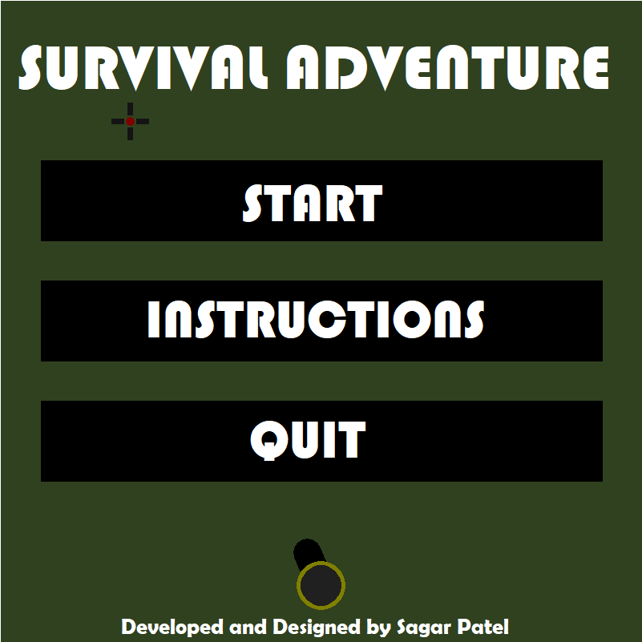
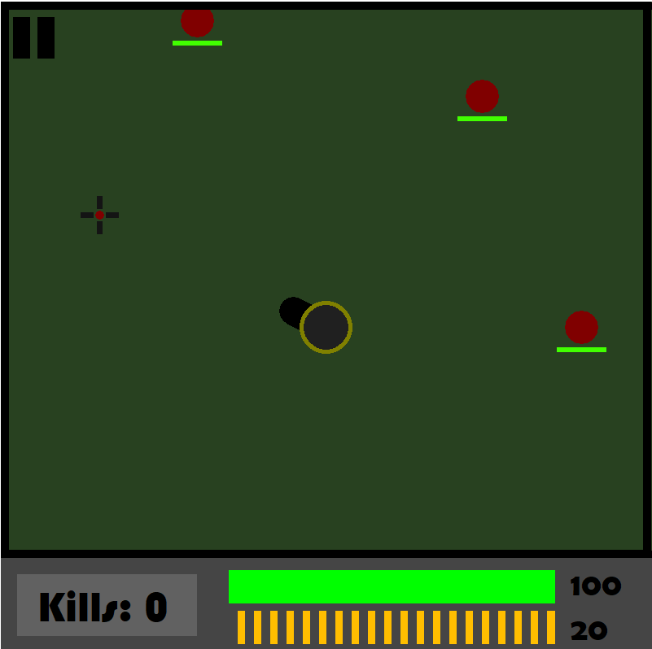
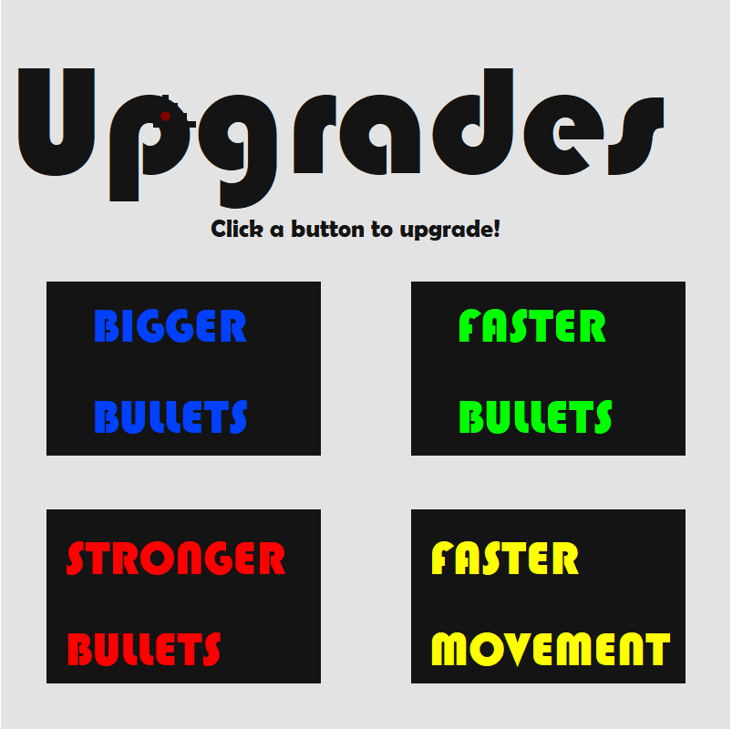
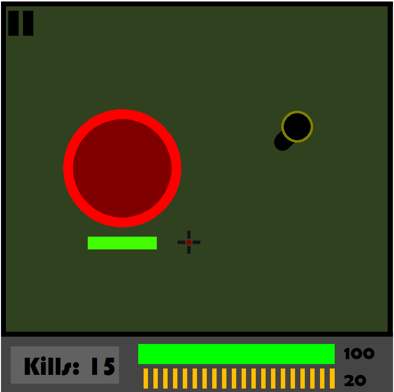

# Turing Shooter Game
The project is a 2D survival shooter game using Turing 4.1.1!

## Table of Contents
* [Dependencies](#dependencies)
* [Installation](#installation)
* [Contributors](#contributors)
* [Contact](#contact)

## Screenshots
| Intro    | Level 1    |
|-------------|-------------|
|  |  |
| Upgrade    | Level 3    |
|  |  |

## Dependencies
[Turing 4.1.1](http://compsci.ca/holtsoft/)

## Installation
* Make sure all the dependencies are installed
* Download the files
  * Option 1: 🍴 Fork this repository!
  * Option 2: 🧪 Clone the repository to your local machine using https://github.com/sagarpatel211/ICS2O1-Project.git!
* Run *Final Turing Game Project.t* in Turing 4.1.1 to run the program
* Use the mouse to point, arrow keys to move your player, and spacebar to shoot, and r to reload **only** when your cartridge is empty

## Contributors
| <a href="https://github.com/sagarpatel211" target="_blank">**Sagar Patel**</a> |
| :---: |
|     |
| <a href="https://github.com/sagarpatel211" target="_blank">`github.com/sagarpatel211`</a> |

## Contact
[Email](mailto:sa24pate@uwaterloo.ca) | [Website](https://sagarpatel211.github.io/)
